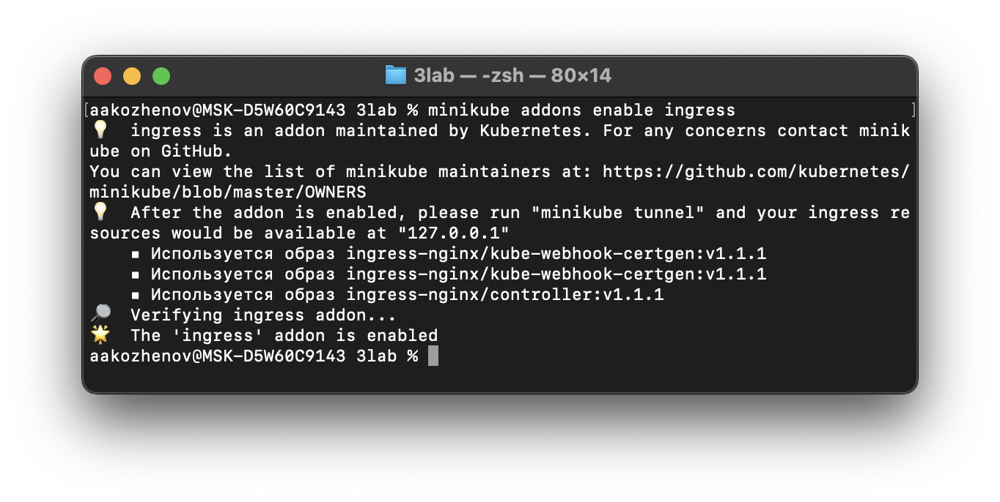

University: [ITMO University](https://itmo.ru/ru/) \
Faculty: [FICT](https://fict.itmo.ru)\
Course: [Introduction to distributed technologies](https://github.com/itmo-ict-faculty/introduction-to-distributed-technologies)\
Year: 2024/2025\
Group: K4110C\
Author: Kozhenov Artyom Andreevich\
Lab: #3\
Date of create: 1.12.2024\
Date of finished: 5.12.2024

____

## Лабораторная работа №3 "Сертификаты и "секреты" в Minikube, безопасное хранение данных.

### Цель работы
Познакомиться с сертификатами и "секретами" в Minikube, правилами безопасного хранения данных в Minikube.

## Ход работы

### 1. Создать манифест config-map:
> A ConfigMap is an API object used to store non-confidential data in key-value pairs

### 2. Создать манифест ReplicaSet'а:
> A ReplicaSet's purpose is to maintain a stable set of replica Pods running at any given time.

 

### 3. Подключить аддон ingress:

### 4. Создать TLS сертификат и ключ с помощью утилиты openssl :

### 5. Прокинуть секрет в k8s:

### 6. Создать манифест Ingress'а:

### 7. Применить все манифесты:

### 8. Добавим запись в таблицу хостов `/etc/hosts`.

### 9. Проверим результат в браузере:
#### Обращение к `aakozhenov.io`

#### Сертификат:

### Схема организации:
