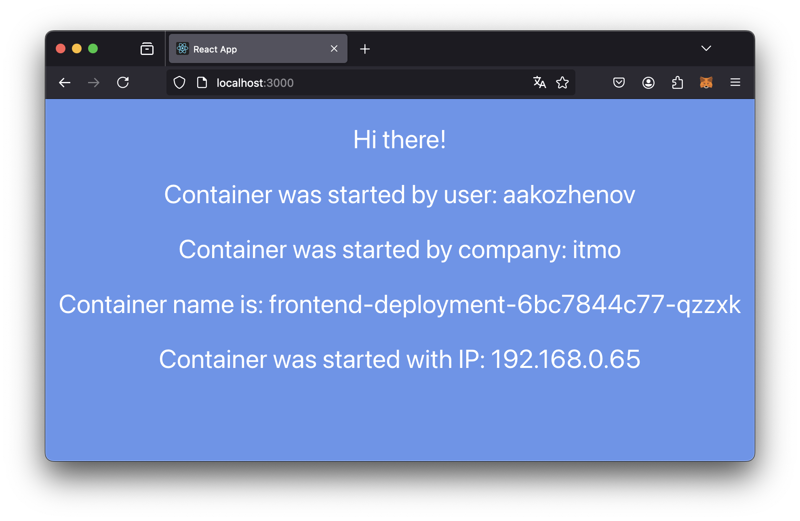
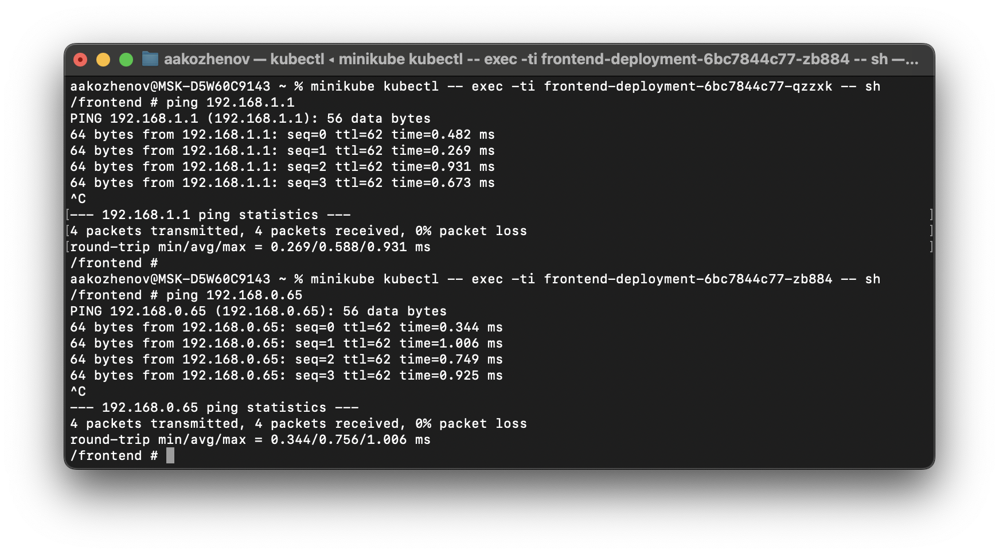
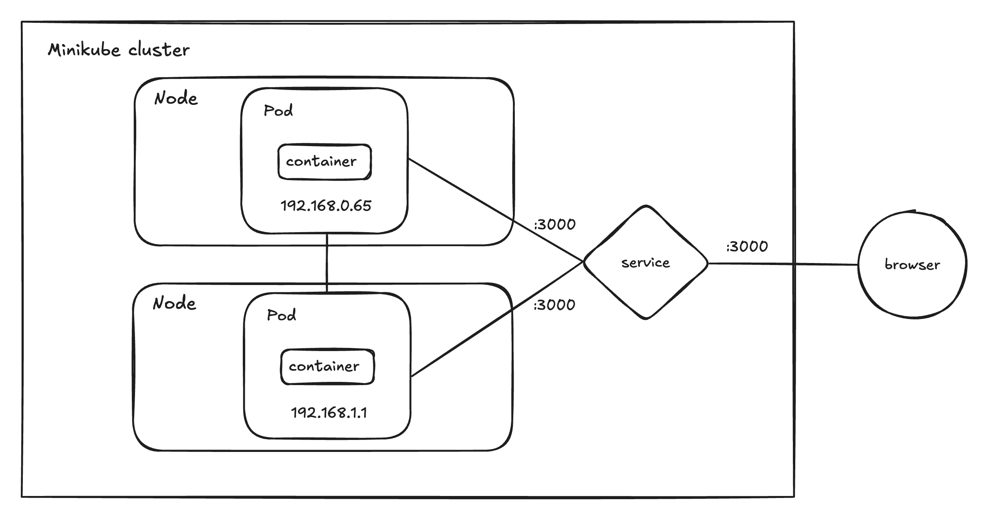

University: [ITMO University](https://itmo.ru/ru/) \
Faculty: [FICT](https://fict.itmo.ru)\
Course: [Introduction to distributed technologies](https://github.com/itmo-ict-faculty/introduction-to-distributed-technologies)\
Year: 2024/2025\
Group: K4110C\
Author: Kozhenov Artyom Andreevich\
Lab: #3\
Date of create: 1.12.2024\
Date of finished: 5.12.2024


____

## Лабораторная работа №4 "Сети связи в Minikube, CNI и CoreDNS"

### Цель работы
Познакомиться с CNI Calico и функцией IPAM Plugin, изучить особенности работы CNI и CoreDNS.

## Ход работы

### 1. Запустить minikube с cni calico:


> - CNI или Container Network Interface - это спецификация для стандартизации процесса подключения сетевых интерфейсов к контейнерам. CNI обеспечивает гибкость и адаптивность сетевой инфраструктуры, позволяя интегрировать различные сетевые решения в Kubernetes.
> - Авторы CNI пошли путём создания минимально возможной спецификации, предназначение которой — стать лёгкой прослойкой между исполняемой средой контейнера и плагинами. Все необходимые сетевые функции реализуются именно в плагинах|
> - Calico — плагин сетевой безопасности, который позволяет рабочим нагрузкам Kubernetes беспрепятственно и безопасно взаимодействовать друг с другом


### 2. Создать дополнительную ноду в minikube и проверить успешность создания:


 

### 3. Найти и удалить дефолтные IP Pools:


### 4. Создать конфигурации новых IP Pools. Я выбрал вариант со стойками:
rack-0-ippool.yaml:
```yaml
apiVersion: projectcalico.org/v3
kind: IPPool
metadata:
  name: rack-0-ippool
spec:
  cidr: 192.168.0.0/24
  ipipMode: Always
  natOutgoing: true
  nodeSelector: rack == "0"
```
rack-1-ippool.yaml:
```yaml
apiVersion: projectcalico.org/v3
kind: IPPool
metadata:
  name: rack-1-ippool
spec:
  cidr: 192.168.1.0/24
  ipipMode: Always
  natOutgoing: true
  nodeSelector: rack == "1"
```


### 5. С помощью утилиты calicoctl создать новые IP Pools и проверить успешность создания:


### 6. Создать Deployment и применить манифест:
Воспользуемся манифестом из прошлой ЛР:
```yaml
apiVersion: apps/v1
kind: Deployment
metadata:
  name: frontend-deployment
  labels:
    app: frontend
spec:
  replicas: 2
  selector:
    matchLabels:
      app: frontend
  template:
    metadata:
      labels:
        app: frontend
    spec:
      containers:
        - name: frontend
          image: ifilyaninitmo/itdt-contained-frontend:master
          ports:
            - containerPort: 3000
          env:
            - name: REACT_APP_USERNAME
              value: aakozhenov
            - name: REACT_APP_COMPANY_NAME
              value: itmo
```


### 7. Создать сервис и прокинуть порты с хостовой машины:


### 8. Проверить доступность в браузере:



### 9. Найдем адреса подов:


### 10. Проверка доступности подов внутри сети:


### Схема:
