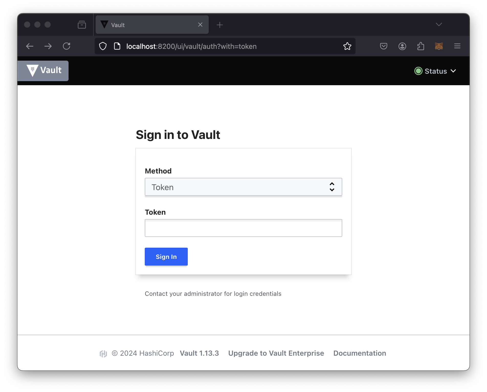
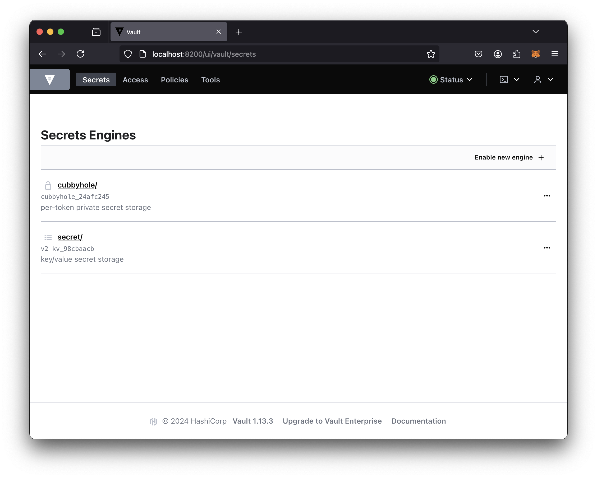
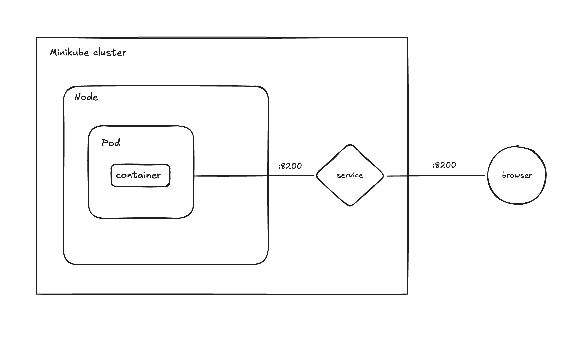

University: [ITMO University](https://itmo.ru/ru/) \
Faculty: [FICT](https://fict.itmo.ru)\
Course: [Introduction to distributed technologies](https://github.com/itmo-ict-faculty/introduction-to-distributed-technologies)\
Year: 2024/2025\
Group: K4110C\
Author: Kozhenov Artyom Andreevich\
Lab: #1\
Date of create: 24.11.2024\
Date of finished: 28.11.2024


____

## Лабораторная работа №1 "Установка Docker и Minikube, мой первый манифест."
### Описание
Это первая лабораторная работа в которой вы сможете протестировать Docker, установить Minikube и развернуть свой первый "под".

### Цель работы
Ознакомиться с инструментами Minikube и Docker, развернуть свой первый "под".

## Ход работы

### 1. Установка окружения — Docker и minikube:

Т.к. на моей машине уже установлен весь необходимый софт, перейду сразу к пункту 2.

### 2. Подтянуть образ HashiCorp Vault:

```bash
docker pull vault:1.13.3
```
Вывод:


 

### 3. Развертывание minikube cluster:

```bash
minikube start
```
Вывод:


### 4. Создание манифеста:

```bash
nano first-pod.yaml
```
Результат:

```yaml
apiVersion: v1
kind: Pod
metadata:
  name: "vault"
  namespace: default
  labels:
    app: "vault"
spec:
  containers:
  - name: vault
    image: "vault:1.13.3"
    ports:
    - containerPort: 8200
```

### 5. Развертывание пода:

```bash
minikube kubectl -- apply -f first-pod.yaml
```

Вывод:


### 6. Обращение к localhost:8200:

Вывод:



### 7. Поиск кредов в логах:
```bash
minikube kubectl logs vault
```

Вывод:


### 8. Авторизация:

Вывод:




### Схема организации:
